# Walkthrough: Fluxo n8n v2 - Relatório Completo TBDC

## Contexto do Taiuan (WhatsApp)

Após ler a conversa do grupo "Avaliações - TBDC", o problema real é:

> **"Preciso pegar o PMG e a altura de planta e vincular nos campos e cultivares certas. Falta mais informações/IDs para fazer PROCV."** — Taiuan, 09/04/2026

O Taiuan baixa o relatório de competições da plataforma (25 colunas) e recebe o relatório de avaliações via n8n (14 colunas), mas **não consegue cruzar** porque os IDs disponíveis são insuficientes — cultivar se repete entre campos, campo tem múltiplas cultivares, etc.

### Solução implementada
O novo fluxo faz o JOIN automaticamente dentro do n8n, entregando **uma única planilha com 29 colunas** onde PMG e Altura da Planta já estão na linha correta de cada campo + cultivar.

---

## O que mudou: Antes vs Depois

| Aspecto | Fluxo Antigo | Fluxo Novo |
|---|---|---|
| Colunas | 14 (só avaliação) | **29** (competição + avaliação) |
| Dados de PMG/Altura | Sim, mas sem vínculo | **Vinculados ao campo e cultivar** |
| Dados da plataforma | Não tinha | ✅ Todas as 25 colunas |
| PROCV necessário? | Sim (e não funcionava) | **Não — tudo na mesma linha** |
| APIs chamadas | 1 (evaluation) | **4** (competition + fazenda + variedade + evaluation) |

---

## As 29 Colunas do Relatório Final

| # | Coluna | Fonte | Novidade? |
|---|---|---|---|
| 1-25 | (mesmas 25 da plataforma) | Competition + Fazenda + Variedade | — |
| 26 | **Altura da Planta (cm)** | Evaluation → others (média) | ✅ NOVO |
| 27 | **PMG (g)** | Evaluation → others (média) | ✅ NOVO |
| 28 | **ID Avaliação** | Evaluation | ✅ NOVO |
| 29 | **ID Campo Avaliado** | Evaluation | ✅ NOVO |

---

## Arquitetura do Fluxo

```mermaid
flowchart LR
    A["⏰ Trigger<br/>Seg/Qui 08:30"] --> B["1️⃣ GET<br/>Competitions"]
    B --> C["2️⃣ Store"]
    C --> D["3️⃣ GET<br/>Fazendas"]
    D --> E["4️⃣ Store"]
    E --> F["5️⃣ GET<br/>Variedades"]
    F --> G["6️⃣ Store"]
    G --> H["7️⃣ GET<br/>Evaluations"]
    H --> I["8️⃣ Store"]
    I --> J["9️⃣ JOIN<br/>29 colunas"]
    J --> K["🔟 Excel"]
    K --> L["1️⃣1️⃣ Email"]

    style J fill:#E65100,color:#fff
```

O nó **"9 JOIN Final"** é onde a mágica acontece:
- Cria um mapa de avaliações indexado por `competitionId + cultivarCpId`
- Para cada tratamento de cada competição, busca no mapa a avaliação correspondente
- Agrega PMG e Altura (média das amostras)
- Gera a linha final com 29 colunas

---

## ⚠️ 3 Passos Antes de Testar

> [!IMPORTANT]
> ### 1. Criar credencial "TBDC Bearer Token" no n8n
> Os nós **3 GET Fazendas** e **5 GET Variedades** usam a API legada com Bearer Token.
> 
> No n8n → Settings → Credentials → **Add Credential** → **Header Auth**:
> - **Name:** `TBDC Bearer Token`
> - **Header Name:** `Authorization`  
> - **Header Value:** `Bearer wgJDJMLBbr3l...` (o token completo)
>
> Depois anote o ID da credencial e substitua `CRIAR_CREDENTIAL_BEARER` no JSON (aparece 2 vezes, nós 3 e 5).

> [!WARNING]
> ### 2. Validar os campos do endpoint de Competition
> Execute **apenas o nó "1 GET Competitions"** e verifique o JSON retornado.
> O nó "2 Store" mostra as `sample_keys` — os nomes reais dos campos.
>
> Se os nomes forem diferentes (ex: `farm_id` em vez de `farmId`), o código já tenta ambas as variações. Se ainda assim não bater, avise e eu ajusto.

> [!TIP]
> ### 3. Teste incrementalmente
> 1. Execute nó 1 → verifique se `count > 0`
> 2. Execute nó 3 → verifique se fazendas retornam (pode dar 401 se o token expirou)
> 3. Execute nó 5 → verifique variedades
> 4. Execute nó 7 → verifique evaluations
> 5. Execute nó 9 → verifique se as 29 colunas aparecem com PMG e Altura preenchidos

---

## Arquivo gerado

📄 [Evaluation TBDC v2.json](file:///C:/Users/leonardo.alves/Claude/Relatorio Avaliacoes/Evaluation TBDC v2.json) — Pronto para importar via **n8n → Workflows → Import from File**
